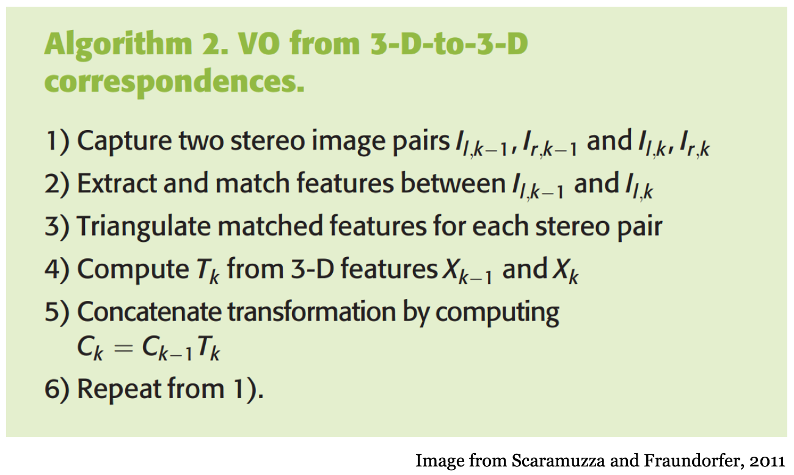

# Robot Perception - Stereo Visual Odometry

***This class activity is to be done as individuals, not with partners nor with teams.***

### How to get started →

Begin by reading this entire writeup and making sure you have a good understanding of it. Next, spend some time planning how you’re going to approach the problem. 

## Introduction

---

In this class activity, you will implement the stereo visual odometry algorithm to estimate the motion of a robot using stereo images. You will start by implementing the stereo visual odometry algorithm using the OpenCV library. You will then test your implementation on a dataset of stereo images and evaluate the performance of your algorithm.

Stereo visual odometry is the process of estimating the motion of a robot using stereo images. The algorithm estimates the motion of a robot by tracking the features in the stereo images and computing the relative pose between the camera frames. This is then used to estimate the motion of the robot.


### Algorithm Steps:



---

## Objectives

- Learn how visual odometry can be used to estimate the motion of a robot
- Implement the stereo visual odometry algorithm using the OpenCV library
- Test the implementation on a dataset of stereo images

## Resources

- [Visual Odometry Tutorial](https://rpg.ifi.uzh.ch/docs/VO_Part_I_Scaramuzza.pdf)
- [Epipolar Geometry](https://learnopencv.com/introduction-to-epipolar-geometry-and-stereo-vision/
)
- [OpenCV](https://docs.opencv.org/4.x/index.html)

## Requirements

- Your python script should run without errors
- Your code should be well documented
- Your code should NOT download the dataset from the internet (we will have a copy of the dataset)
- Your code should NOT use any external libraries other than OpenCV, Numpy, and Matplotlib
  
## What we provide

- Detailed instructions to download the dataset
- A template python script with the necessary imports and function definitions


## The KITTI Dataset

The KITTI dataset is a popular dataset for visual odometry and SLAM research. The dataset contains stereo images, camera calibration parameters, and ground truth poses for the stereo images. You will use the KITTI dataset to test your implementation of the stereo visual odometry algorithm.

You can download the KITTI dataset from the following link:

https://www.cvlibs.net/datasets/kitti/eval_odometry.php

Make sure you download only the gray images and the calibration files for the stereo camera. You will use the gray images to test your implementation of the stereo visual odometry algorithm.


**You must also download the ground truth poses for the stereo images. The ground truth poses are provided in a text file with the following format:**

Each row of the file contains the first 3 rows of a 4x4 homogeneous pose matrix flattened into one line.
It means that this matrix:

```
r11 r12 r13 tx
r21 r22 r23 ty
r31 r32 r33 tz
0   0   0   1
```

is represented in the file as a single row: `r11 r12 r13 tx r21 r22 r23 ty r31 r32 r33 tz`


This means you will only need the `tx` and `tz` values from the ground truth poses to evaluate the performance of your algorithm.

**Note: You will need to parse the ground truth poses file to extract the `tx` and `tz` values. Also, your visual odometry estimation is only limited to 2D transformations**

## What to submit

You must submit a package with the follow file structure


```bash
visual_odometry
├── visual_odometry.py # Your implementation
└── config.yaml
```


Example command to run the script: `python3 visual_odometry.py --config config.yaml`

The `config.yaml` file contains the following fields:

```yaml
images: data_odometry_gray # Top-level folder containing grayscale images
poses: data_odometry_poses # Top-level folder containing poses
sequence: 00 # Sequence number to select dataset (Can be changed to 01->10)
frame_start: 0 # ID of the starting frame. (Will be changed during grading)
frame_end: 100 # ID of the ending frame. Full SVO occurs between [frame_start, frame_end] (Will be changed during grading)
csv_path: output.csv # CSV name
```

Your code should accept a custom yaml file containing the location of the images, groundtruth poses, sequence numbers, frame start, frame end, and output csv name.


For example, if you are running the script on the KITTI dataset, the `images` argument should be the path to base of the dataset, which means, running `ls -R` here should give you -
```
ls -R data_odometry_gray
dataset

data_odometry_gray/dataset:
sequences

data_odometry_gray/dataset/sequences:
00	02	04	06	08	10	12	14	16	18	20
01	03	05	07	09	11	13	15	17	19	21

data_odometry_gray/dataset/sequences/00:
calib.txt	image_0		image_1		times.txt
```

A similar structure is present for the `poses` directory.

*Please make sure you adhere to the structure above, if your package doesn’t match it the grader will give you a **zero***

## Grading considerations

- **Late submissions:** Carefully review the course policies on submission and late assignments. Verify before the deadline that you have submitted the correct version.
- **Environment, names, and types:** You are required to adhere to the names and types of the functions and modules specified in the release code. Otherwise, your solution will receive minimal credit.

## Part 1 : Motion Estimation (between two frames)

---

In this part, you will only estimate the motion between two stereo frames. You will use the OpenCV library to extract features from the stereo images and compute the relative pose between the camera frames. This part is crucial as it will help you understand the stereo visual odometry algorithm and how to estimate the motion of a robot using stereo images.

The template code provided to you contains various functions which you need to implement. Go over the template code and implement the functions.

To enable you to write only 1 python file, You can test the implementation of Part 1 by running the script with the following command

`python3 visual_odometry.py --config config.yaml --simple`

```python
def two_frame_vo(config_path):
    """Main function for stereo visual odometry using only two frames."""
    with open(config_path, 'r') as file:
        config = yaml.safe_load(file)

    # Camera projection matrices (hard code it since it doesn't change)
    P0 = None
    P1 = None

    images_path = config['images'] # Path to the images
    sequence = config['sequence'] # Sequence name
    frame_start = config['frame_start'] # This is the frame number to start with
    frame_end = frame_start + 1 # We are using only two frames

    # Load the images and poses for the two frames using the correct sequence and frame numbers
    image_l_start = None
    image_r_start = None
    image_l_end = None
    image_r_end = None
    trajectory = [[0,0,0,0,0,0,0,1]] # Initial pose


    # Decompose projection matrices

    # Compute disparity map for start frames

    # Compute depth map for start frames

    # Extract features from start left frame

    # Track features from start left frame to end left frame

    # Get 3D points of good matches

    # Estimate motion from 3D points

    # Get pose of end frame and append to trajectory

    for t in trajectory:
        print(t)
```

## Part 2 : Stereo Visual Odometry (between multiple frames)

---

Now that you have your basic motion estimation working, you will extend it to estimate the motion between multiple frames. Add your main loop to estimate the motion between the `frame_start` and `frame_end` configurations.

# Submission and Assessment

---

**You are also allowed the usage of any OpenCV function**

Submit using the Github upload feature on [autolab](https://autolab.cse.buffalo.edu)

**Note: Make sure your code complies to all instructions, especially the naming conventions. Failure to comply will result in zero credit**


**Note: You will not receive partial credit for files working /not working. Please make sure your scripts execute**
